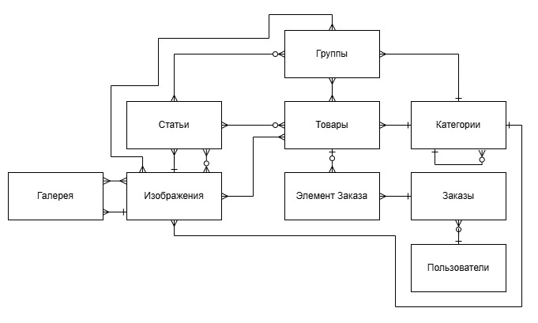
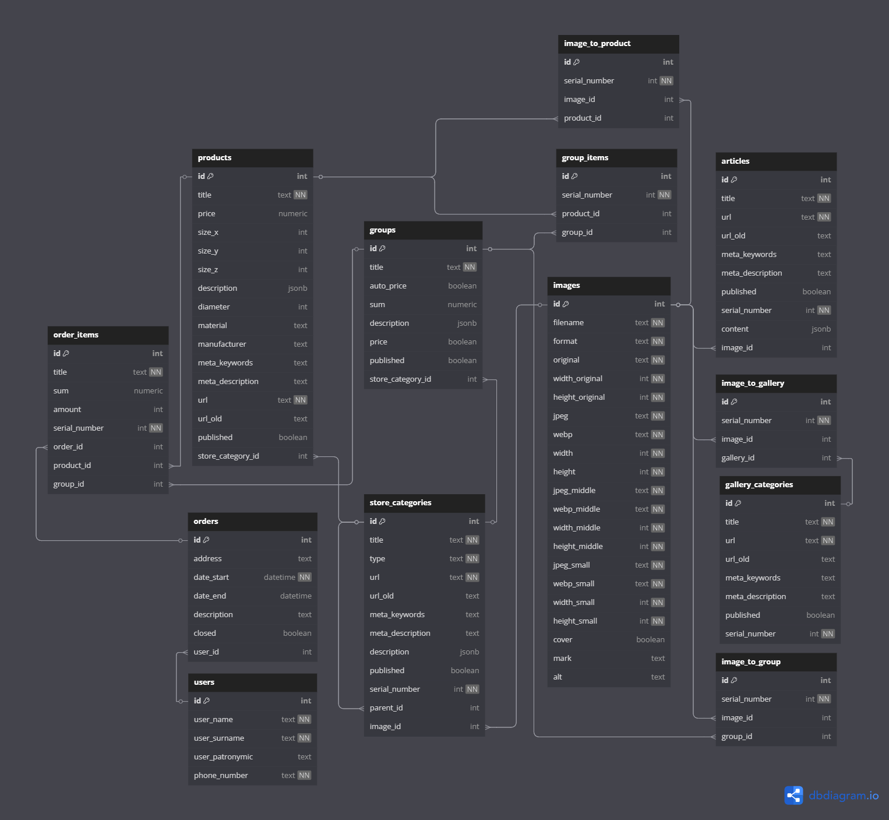
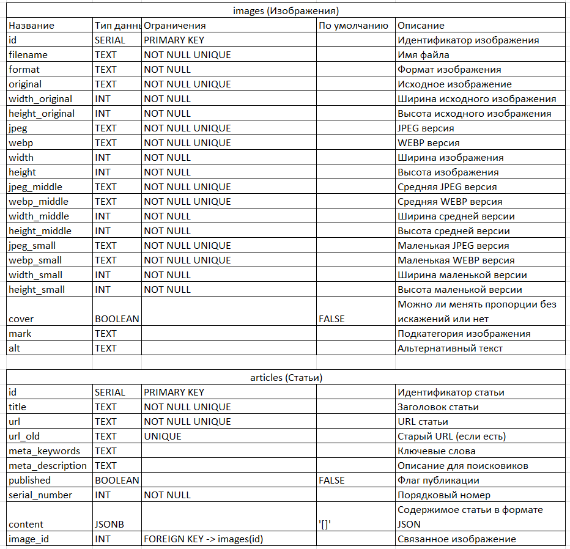
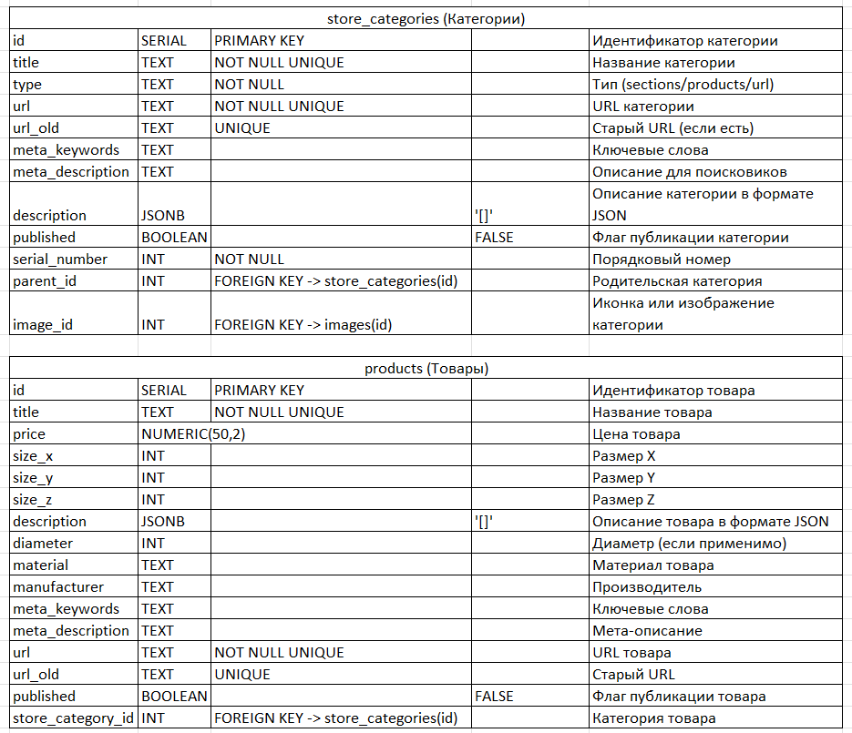
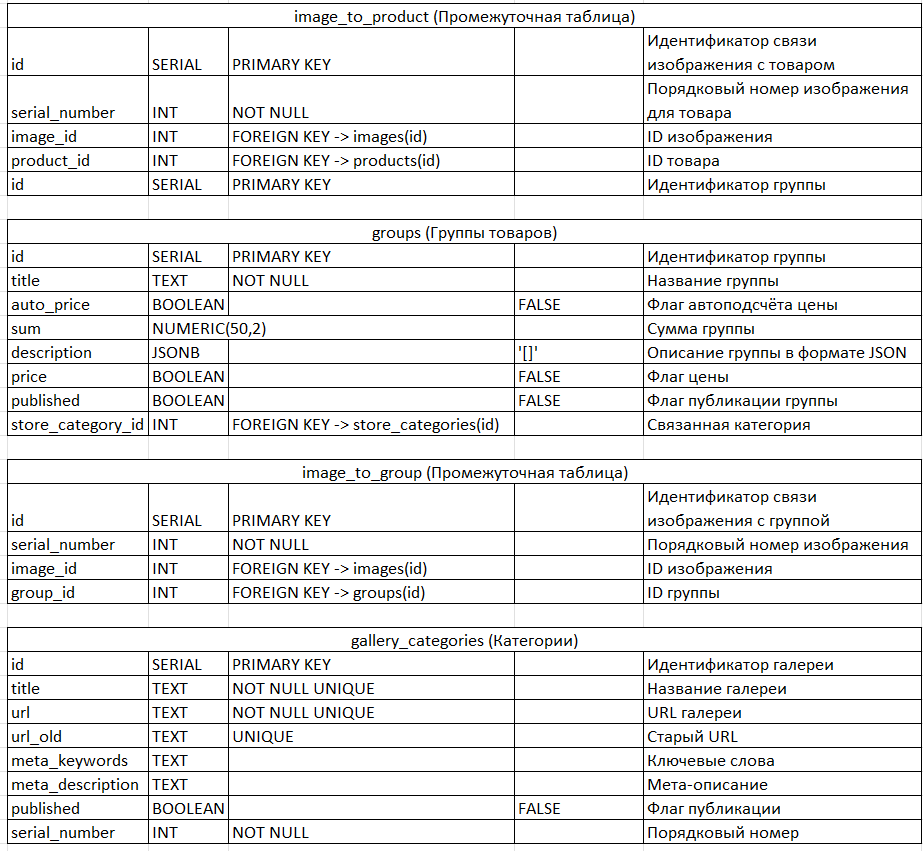
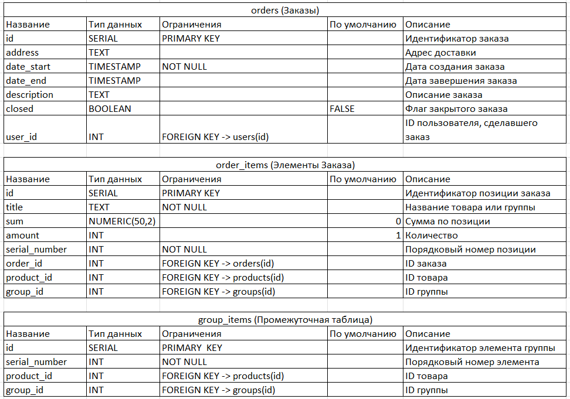

# Учебный проект

Цель: Проектирование базы данных<br>
Название проекта: Мастерская лепного декора

## Этапы проектирования

- Концептуальная модель
- Логическая модель
- Физическая модель
- DDL

### Концептуальная модель




Можно открыть в оригинальную таблицу на сайте [app.diagrams.net](https://app.diagrams.net). XML с сохранением лежит в директории conceptual-model.

### Логическая модель



Можно открыть в оригинальную таблицу на сайте [dbdiagram.io](https://dbdiagram.io). DML модели лежит в файле в директории logical-model.

### Физическая модель









### DDL

Скрипт со структурой базы данных можно найти [тут](./database/1-init/init.sql)

### Наполнение базы данных

Наполнение базы включает:

- [images](./database/init/2-insert-images.sql)
- [categories](./database/init/3-insert-categories.sql)
- [articles](./database/init/4-insert-articles.sql)
- [products](./database/init/5-insert-products.sql)
- [groups](./database/init/6-insert-groups.sql)
- [gallery](./database/init/7-insert-gallery.sql)
- [users](./database/init/8-insert-users.sql)
- [orders](./database/init/9-insert-orders.sql)

### Запросы в базу данных

- [request](./database/init/requests.sql)

## Запуск запросов и инициализация

Для произведения инициализации и запуска запросов необходимо выполнить следующую команду.

```bash
docker compose -f dc-init.yml up
```

Это запустит инициализацию после которой сразу же выполнятся все запросы.

Для повторного запуска необходимо нажать CTRL + C для выхода из контейнера и ввести следующую команду.

```bash
docker compose -f dc-init.yml down
```

После удалить папку по адресу ./database/volume.

После чего можно повторно запустить весь процесс или изменить все скрипты в папке ./database/init