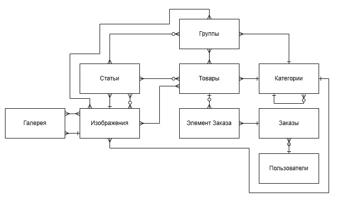
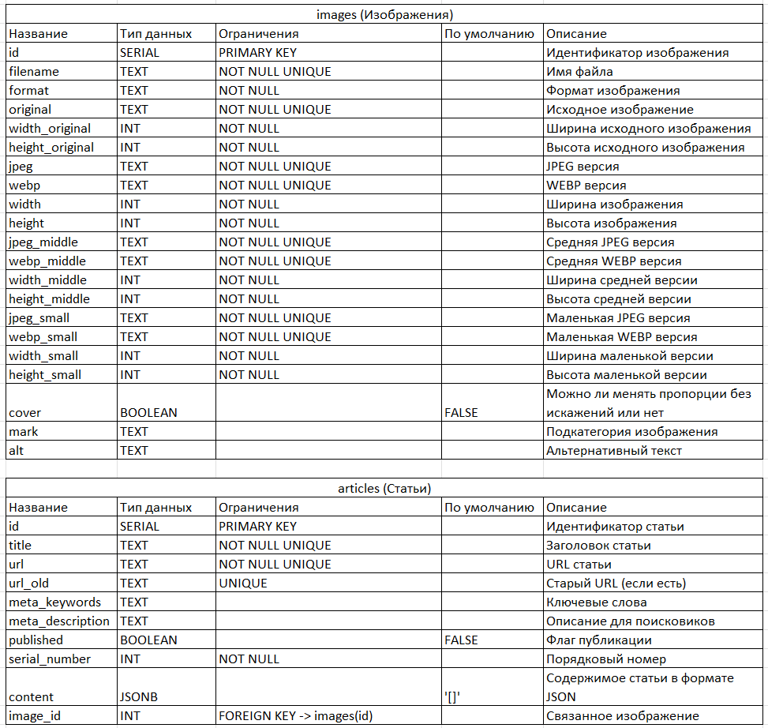
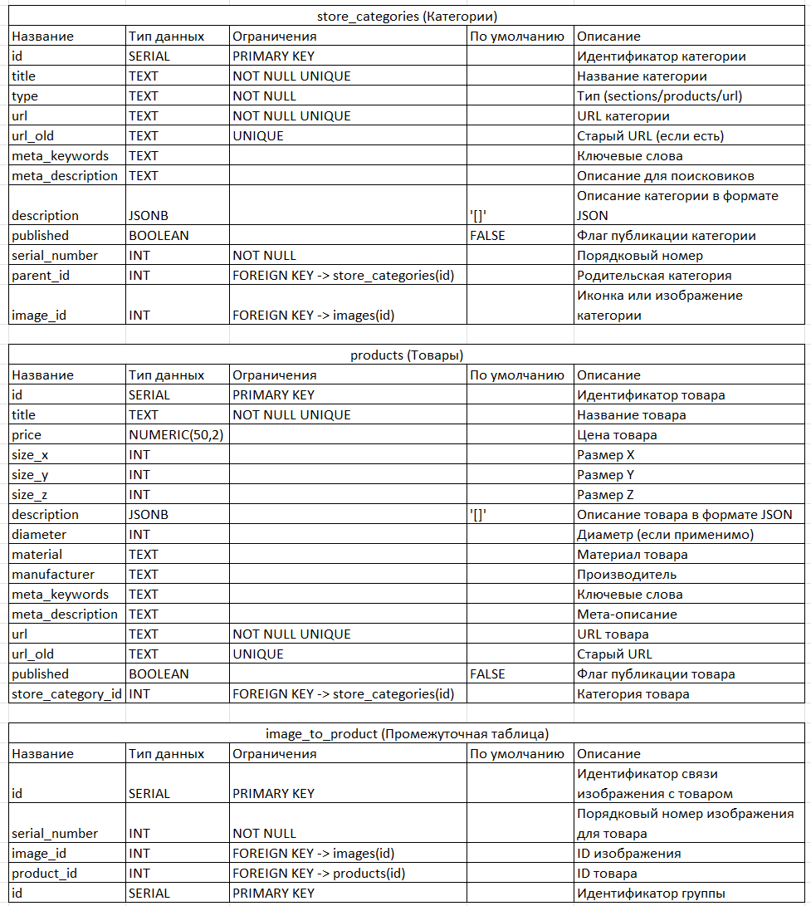
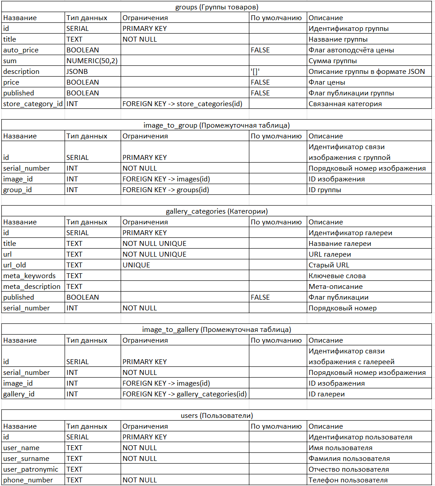

# Учебный проект

Цель: Проектирование базы данных 
Название проекта: Мастерская лепного декора

## Этапы проектирования

- Концептуальная модель
- Логическая модель
- Физическая модель
- DDL

### Концептуальная модель

Можно открыть в оригинальную таблицу на сайте [app.diagrams.net](https://app.diagrams.net). XML с сохранением лежит в директории conceptual-model.

### Логическая модель

Можно открыть в оригинальную таблицу на сайте [dbdiagram.io](https://dbdiagram.io). DML модели лежит в файле в директории logical-model.

### Физическая модель

### DDL

Скрипт со структурой базы данных можно найти [тут](./database/init/init.sql)